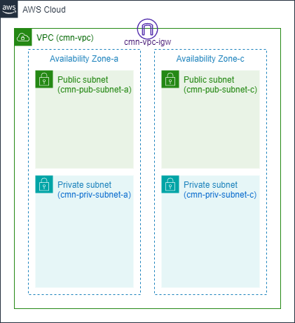

### 概要
* AWS環境の共通ネットワーク基盤
* 主にネットワークやセキュリティグループ

### 前提条件
* tfstate用S3バケットが作成されていること

### 構成図


### 利用方法
- AWSのプロファイルを設定する
```
aws configure --profile dev-terraform

AWS Access Key ID [None]: xxxx
AWS Secret Access Key [None]: xxxx
Default region name [None]: ap-northeast-1
Default output format [None]: json

aws configure list --profile dev-terraform

```
# 初期設定
cd dev
terraform init -backend-config="dev.tfbackend"

# 適用
terraform plan -var-file=dev.tfvars
terraform apply -var-file=dev.tfvars

# 削除
terraform plan -destroy -var-file=tfvars/terraform.tfvars
terraform destroy -var-file=tfvars/terraform.tfvars
```
