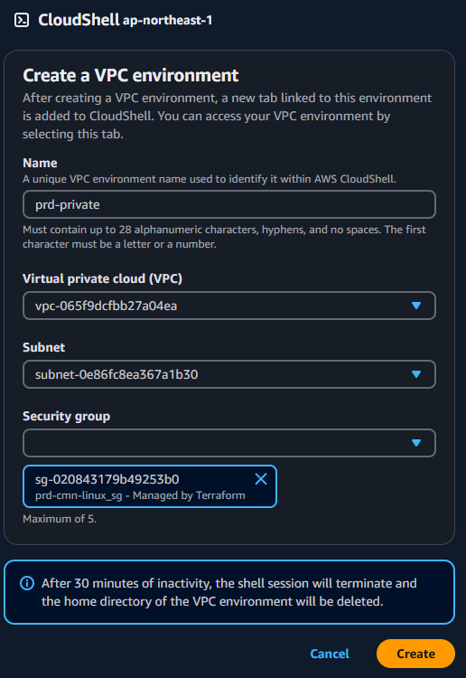
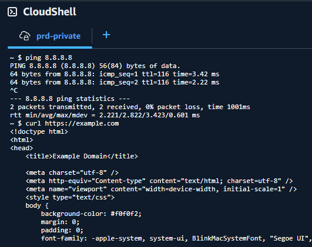

## 概要

- AWS 環境の共通ネットワーク基盤
- 主にネットワークやセキュリティグループ

## 前提条件

- tfstate 用 S3 バケットが作成されていること

## 構成図


## 利用方法

### 変更差分確認

- PR 作成時に GitHub Actions が発火し、terraform plan を実行する。

- ローカルから確認
  以下の手順で docker-compose で terraform plan する。

```
# AWS credential setting
$ export AWS_ACCESS_KEY_ID=<your_access_key_id>
$ export AWS_SECRET_ACCESS_KEY=<your_secret_access_key>
$ export AWS_SESSION_TOKEN=<your_session_token>

# plan
$ docker compose run --rm terraform init
$ docker compose run --rm terraform plan
```

### デプロイ

- GitHub Actions でデプロイ
  リポジトリ > Actions > terraform-apply を実行する。

- ローカルからデプロイ
  上記の差分確認手順を実施したうえで、以下の手順で apply する。

```
# apply
$ docker compose run --rm terraform apply -auto-approve
```

### 削除

- ローカルから削除
  上記の差分確認手順を実施したうえで、以下の手順で削除する。

```

# 削除の差分確認

$ docker compose run --rm terraform plan -destroy

# 削除

$ docker compose run --rm terraform destroy -auto-approve

```

### 疎通確認

- AWS マネジメントコンソールから、CloudShell で疎通確認すると踏み台要らずで便利

1. VPC の情報を入力し CloudShell 環境の設定
   

2. CloudShell 環境を立ち上げて ping や curl をたたく
   
